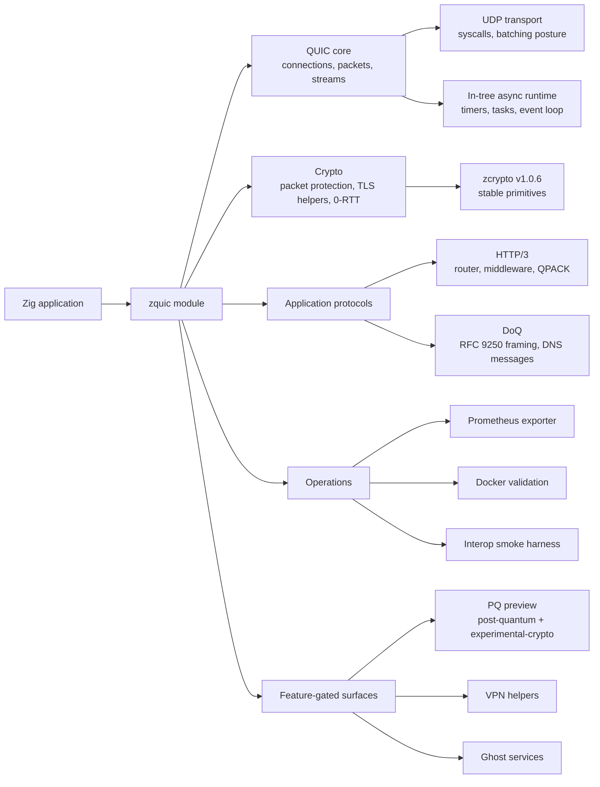
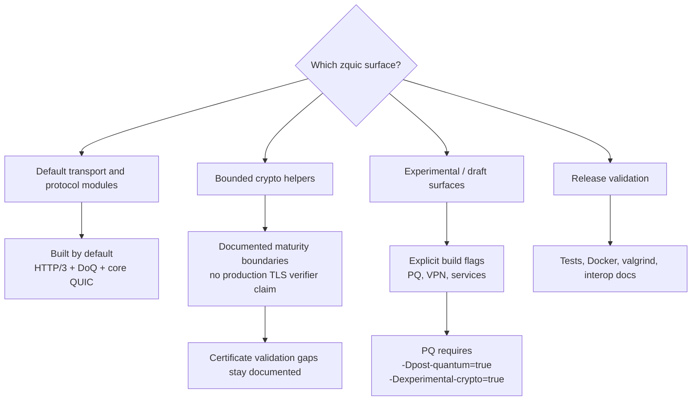
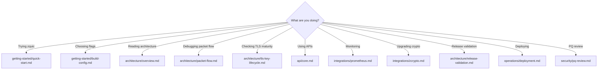

# ZQUIC Documentation

ZQUIC is a modular QUIC, HTTP/3, DNS-over-QUIC, monitoring, and experimental
post-quantum networking stack for Zig. This directory uses one index file,
`docs/README.md`; subdirectories use lowercase descriptive Markdown filenames.

## Documentation Map

```mermaid
flowchart TD
    start["Start here<br/>docs/README.md"]

    start --> gs["Getting Started"]
    start --> arch["Architecture"]
    start --> features["Feature Notes"]
    start --> ref["Reference And Integrations"]
    start --> security["Security And Advisories"]
    start --> operations["Operations"]

    gs --> quick["quick-start.md"]
    gs --> build["build-config.md"]
    gs --> examples["examples.md"]

    arch --> overview["overview.md"]
    arch --> packet["packet-flow.md"]
    arch --> states["state-machines.md"]
    arch --> flow["flow-control-recovery.md"]
    arch --> tls["tls-key-lifecycle.md"]
    arch --> h3doq["http3-doq.md"]
    arch --> monitoring["monitoring.md"]
    arch --> validation["release-validation.md"]
    arch --> runtime["async-runtime.md"]

    features --> foverview["overview.md"]
    features --> crypto["crypto-maturity.md"]
    features --> rfc9001["rfc9001-crypto-audit.md"]
    features --> interop["quic-interop.md"]
    features --> compliance["http3-doq-compliance.md"]
    features --> ssh["ssh-quic.md"]
    features --> vpn["quic-vpn.md"]
    features --> services["services.md"]

    ref --> api["api/core.md"]
    ref --> prom["integrations/prometheus.md"]
    ref --> zcrypto["integrations/zcrypto.md"]

    security --> policy["../SECURITY.md"]
    security --> pqreview["security/pq-review.md"]
    security --> advisories["advisories/*.md"]

    operations --> deploy["deployment.md"]
```

## Runtime Shape

## Stability Model

## Common Paths

## Start Here

- [Quick Start](getting-started/quick-start.md) - build zquic and run the first examples
- [Build Configuration](getting-started/build-config.md) - feature flags and build profiles
- [Examples](getting-started/examples.md) - shipped example binaries and smoke commands

## Architecture

- [System Overview](architecture/overview.md) - component map, responsibilities, and design decisions
- [Packet Flow](architecture/packet-flow.md) - UDP, QUIC packet, stream, HTTP/3, and DoQ data paths
- [State Machines](architecture/state-machines.md) - connection, stream, key phase, shutdown, and PQ reuse states
- [Flow Control And Recovery](architecture/flow-control-recovery.md) - stream windows, receive pressure, loss timers, and recovery loops
- [TLS And Key Lifecycle](architecture/tls-key-lifecycle.md) - RFC 9001 posture, key phases, 0-RTT, and PQ boundaries
- [HTTP/3 And DoQ](architecture/http3-doq.md) - application protocol layering and lifecycle
- [Monitoring](architecture/monitoring.md) - Prometheus exporter and stable metric families
- [Release Validation](architecture/release-validation.md) - local, Docker, valgrind, interop, and release evidence
- [Async Runtime](architecture/async-runtime.md) - runtime architecture
- [Runtime Notes](architecture/runtime-notes.md) - why zquic has no external async dependency

## Feature Notes

- [Feature Overview](features/overview.md) - current module and build-flag map
- [Security](features/security.md) - hardening notes and supported crypto boundaries
- [Crypto Maturity](features/crypto-maturity.md) - stable, draft, and experimental crypto surfaces
- [RFC 9001 Crypto Audit](features/rfc9001-crypto-audit.md) - packet protection and TLS lifecycle audit
- [QUIC Interop](features/quic-interop.md) - external stack plan and known gaps
- [QUIC Ecosystem](features/quic-ecosystem.md) - quiche, ngtcp2, MsQuic, aioquic positioning
- [HTTP/3 And DoQ Compliance](features/http3-doq-compliance.md) - RFC 9114/RFC 9250 notes
- [SSH/QUIC](features/ssh-quic.md) - draft secret-injection integration
- [QUIC VPN](features/quic-vpn.md) - experimental VPN helper surface
- [Services](features/services.md) - GhostBridge, Wraith, CNS, and ZVM maturity
- [Future Features](future-features.md) - intentionally deferred work

## Reference And Integrations

- [Core API](api/core.md) - connection, packet, stream, crypto, and monitoring exports
- [Prometheus Integration](integrations/prometheus.md) - exporter usage and metric names
- [zcrypto Integration](integrations/zcrypto.md) - dependency contract and crypto feature gates

## Security And Advisories

- [Security Policy](../SECURITY.md) - reporting, supported versions, and release audit notes
- [PQ Preview Review](security/pq-review.md) - required checklist before any future PQ graduation claim
- [Accepted Advisories](advisories/accepted.md) - accepted advisories
- [Resolved Advisories](advisories/resolved.md) - resolved advisories

## Operations

- [Deployment Operations](operations/deployment.md) - build profiles, validation, metrics, crypto operations, and incident response

## Build Profiles

| Profile | Command | Purpose |
|---------|---------|---------|
| Default | `zig build` | HTTP/3 and DoQ enabled, PQ disabled |
| Minimal | `zig build -Dhttp3=false -Ddoq=false -Dservices=false -Dvpn=false -Dexamples=false` | Core transport only |
| Tests | `zig build test --summary all` | Unit and integration-style in-tree tests |
| Integration | `zig build integration-tests --summary all` | Cross-module integration tests |
| Fuzz | `zig build fuzz-tests --summary all` | Packet/frame/parser fuzz harnesses |
| PQ Preview | `zig build -Dpost-quantum=true -Dexperimental-crypto=true` | Experimental PQ paths |

## Component Responsibilities

| Component | Primary files | Responsibility |
|-----------|---------------|----------------|
| QUIC core | `src/core/` | connection state, streams, packets, flow control, recovery |
| Networking | `src/net/`, `src/transport/` | UDP sockets, syscall mapping, multiplexing, batching posture |
| Crypto | `src/core/crypto.zig`, `src/crypto/` | packet protection helpers, TLS utilities, key updates, 0-RTT |
| HTTP/3 | `src/http3/` | frames, QPACK subset, router, middleware, server lifecycle |
| DoQ | `src/doq/` | RFC 9250 length framing, DNS messages, resolver/server lifecycle |
| Monitoring | `src/monitoring/` | Prometheus text exporter and runtime telemetry hooks |
| Services | `src/services/` | opt-in Ghost-specific and experimental service modules |

## Documentation Rules

- Keep this file as the only `README.md` under `docs/`.
- Use lowercase descriptive filenames in subdirectories.
- Put diagrams close to the technical page they explain.
- Prefer Mermaid flowcharts and sequence diagrams for protocol and lifecycle docs.
