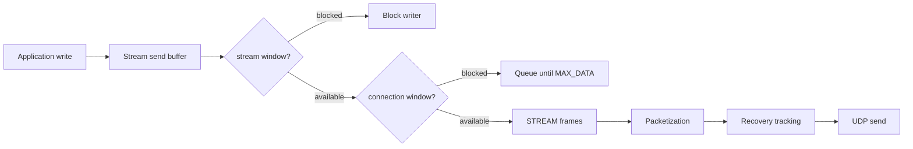
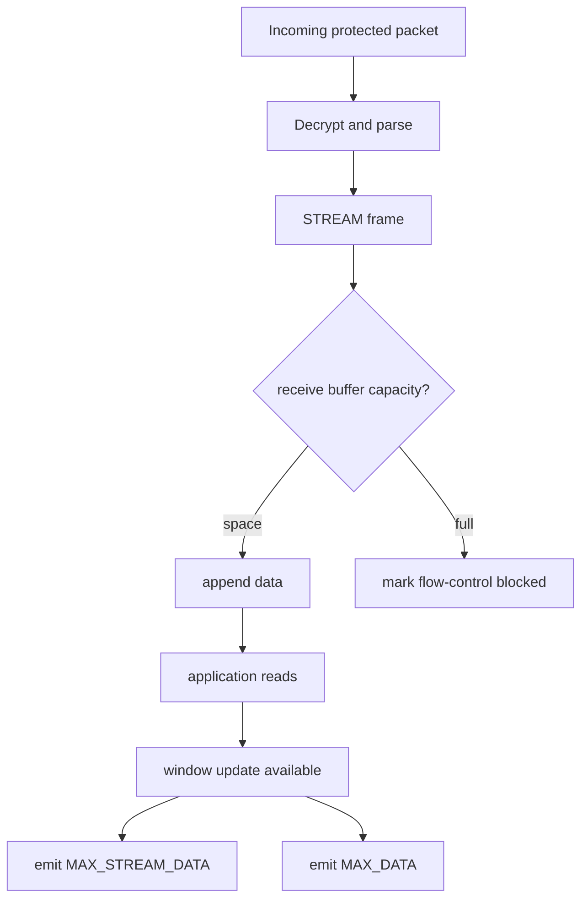
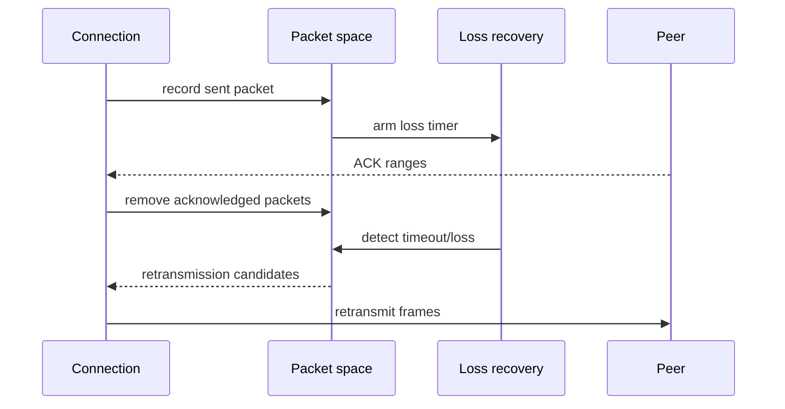
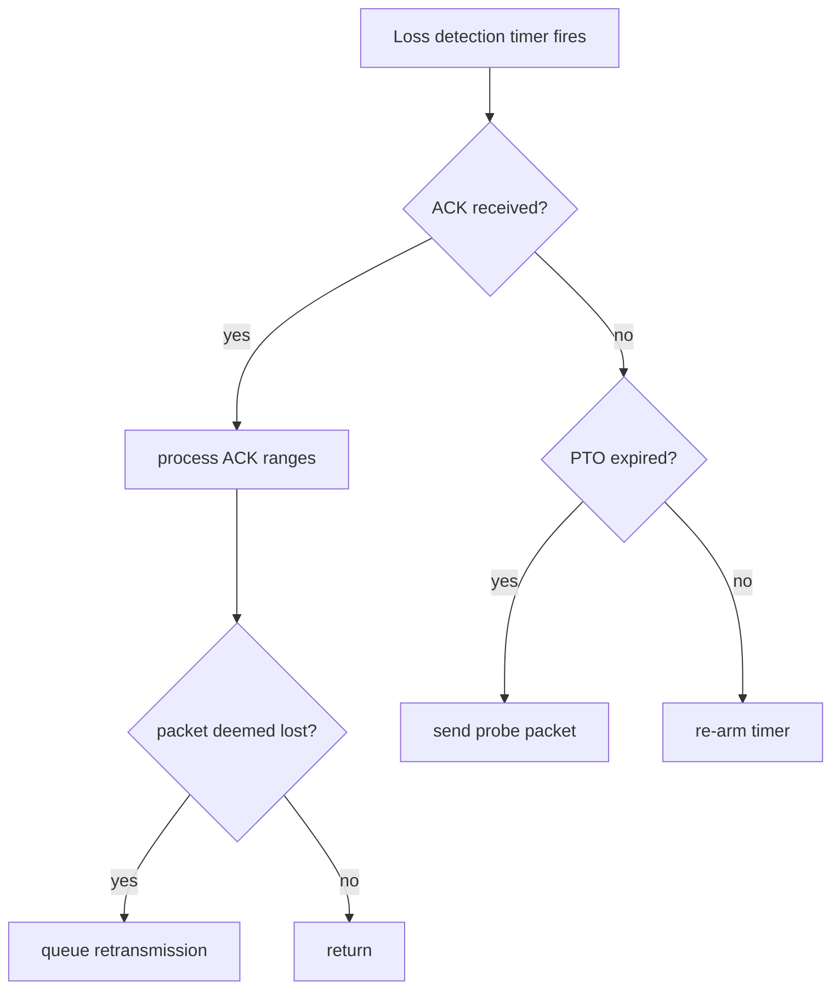
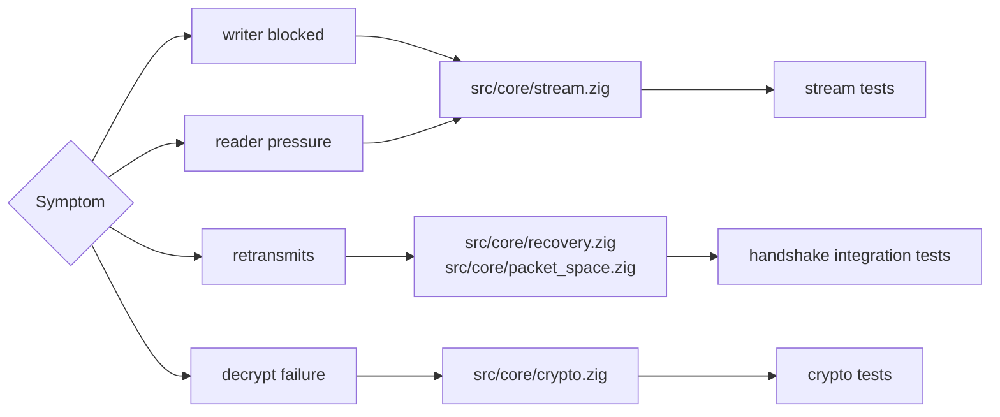

# Flow Control And Recovery

This page describes the moving parts that keep streams bounded and packets
recoverable. The tests are deterministic and local; external RTT, loss, and
congestion evidence is tracked through the interop and release-validation docs.

## Data Movement

## Receive Backpressure

Receive-window tests cover a slow reader filling the receive buffer, then
recovering after the application drains unread data.

## Packet Recovery Loop

## Loss Timer Decision Tree

## Current Guarantees

| Area | Current coverage | Notes |
|------|------------------|-------|
| Send flow control | blocked writer waits for window update | deterministic stream tests |
| Receive flow control | slow reader recovery after drain | deterministic stream tests |
| Packet loss | retransmission candidates removed after timeout | integration tests |
| Key phase + packet number | wrong packet number and old keys reject decrypt | crypto tests |
| External network behavior | planned through interop harness | not claimed as broad production evidence |

## Debugging Map

