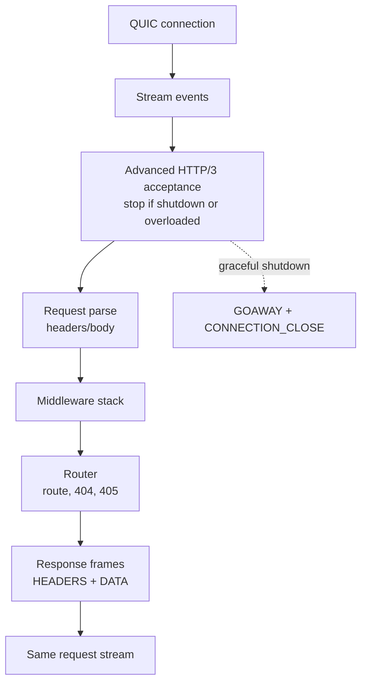
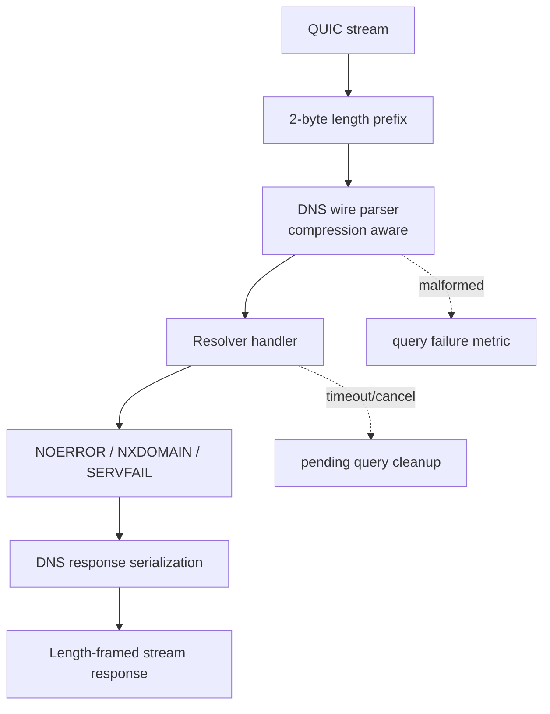

# HTTP/3 And DoQ Architecture

HTTP/3 and DNS-over-QUIC both sit on the same QUIC stream table but have
different lifecycle rules.

## HTTP/3 Server Lifecycle

## DoQ Server Lifecycle

## Hardening Coverage

| Area | Coverage |
|------|----------|
| Body limits | Oversized request bodies produce 413 and clean active request state |
| Response streaming | Responses generate HTTP/3 frame sequences on the request stream |
| Middleware cleanup | Route handling tests verify short-circuit and global middleware behavior |
| 404/405 | Router tests cover fallback and `allow` header generation |
| Concurrent streams | Stream IDs stay isolated across concurrent requests |
| DoQ compression | Valid pointers parse; malformed compression pointers reject |
| DoQ lifecycle | Pending queries can be cancelled, timed out, and freed on deinit |
| Oversized DNS | Oversized and over-counted DNS messages reject deterministically |
