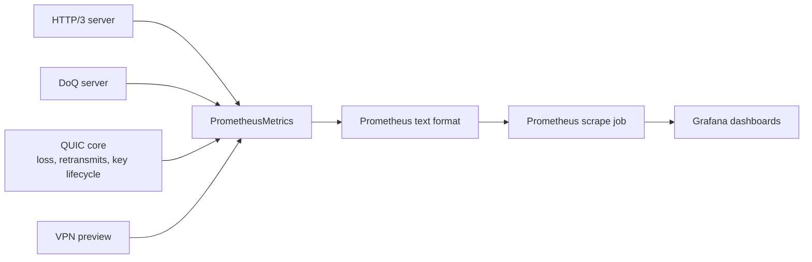
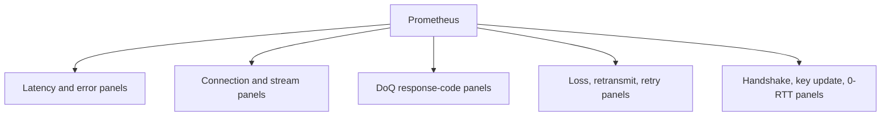

# Monitoring Architecture

ZQUIC exposes a native Prometheus text exporter for runtime and protocol
observability. Metric names use the `zquic_*` prefix and are intended to be
stable across the v0.9.15 release line.

## Metric Flow

## Stable Families

| Family | Examples |
|--------|----------|
| Connection counts | `zquic_http3_connections_active`, `zquic_doq_connections_active` |
| Stream counts | `zquic_http3_streams_active` |
| Queue depth | `zquic_http3_queue_depth` |
| Request duration | `zquic_http3_request_duration_us_sum`, `zquic_http3_request_duration_us_count` |
| HTTP/3 status families | `zquic_http3_status_2xx_total`, `zquic_http3_status_4xx_total` |
| DoQ response codes | `zquic_doq_response_noerror_total`, `zquic_doq_response_servfail_total` |
| Packet loss and retransmits | `zquic_quic_packet_loss_total`, `zquic_quic_retransmits_total` |
| Crypto lifecycle | `zquic_handshake_failures_total`, `zquic_key_updates_total` |
| Close-path events | `zquic_retry_events_total`, `zquic_stateless_reset_events_total` |

## Dashboard Shape

See [Prometheus Integration](../integrations/prometheus.md) for usage.
