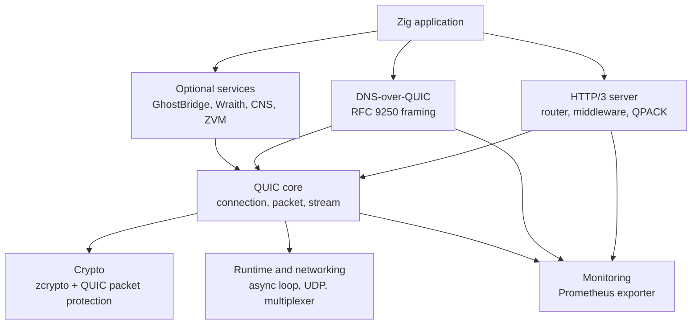
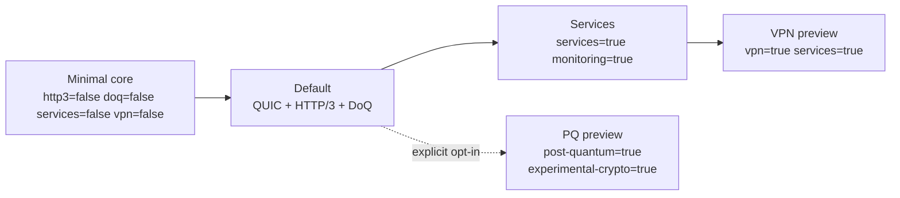

# System Overview

ZQUIC is organized as a set of protocol layers over a small UDP/syscall
boundary. Default builds compile the core, HTTP/3, and DoQ modules; monitoring,
services, VPN, and post-quantum paths are opt-ins. Maturity varies by module and
is not implied by inclusion in the default build.

## Component Map

## Responsibilities

| Layer | Files | Responsibility |
|-------|-------|----------------|
| Application protocols | `src/http3/`, `src/doq/` | HTTP/3, QPACK, routing, DNS length framing, resolver lifecycle |
| QUIC transport | `src/core/` | packet parsing, connection lifecycle, stream table, flow control, recovery |
| Crypto and TLS utilities | `src/core/crypto.zig`, `src/crypto/` | packet protection, key updates, 0-RTT tickets, experimental TLS helpers |
| Runtime and UDP | `src/async/`, `src/net/`, `src/transport/` | event loop, socket wrappers, syscall mapping, connection ID routing |
| Observability | `src/monitoring/` | stable Prometheus metric families and build metadata |
| Optional services | `src/services/`, `src/vpn/` | opt-in Ghost and research surfaces outside default transport claims |

## Build Profiles

## Design Decisions

| Decision | Rationale |
|----------|-----------|
| Low-level socket calls stay in `src/net/sys.zig` | Keeps portability and errno mapping auditable |
| QUIC stream events can be drained once outside the long-running loop | Lets HTTP/3 and DoQ integrate with the real stream table in tests and servers |
| Experimental TLS/PQ helpers are explicitly marked | Prevents scaffolding from being mistaken for production certificate validation |
| Prometheus names use `zquic_*` stable families | Gives operators predictable dashboards across HTTP/3, DoQ, QUIC, VPN, and crypto |
| Docs use one top-level index | Keeps navigation simple while preserving descriptive lowercase files per folder |

## More Detail

- [Packet Flow](packet-flow.md)
- [TLS And Key Lifecycle](tls-key-lifecycle.md)
- [HTTP/3 And DoQ](http3-doq.md)
- [Monitoring](monitoring.md)
- [Release Validation](release-validation.md)
