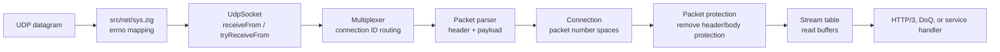
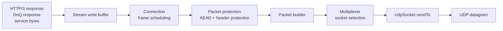
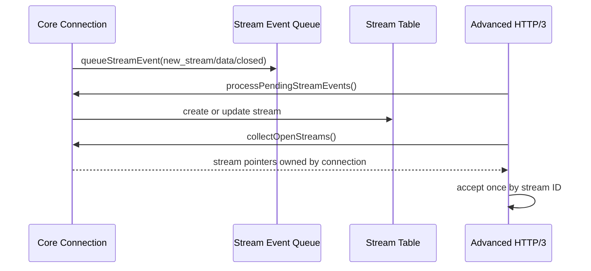

# Packet Flow

This page shows how bytes move through zquic from UDP datagrams to application
protocol handlers and back out.

## Inbound Path

## Outbound Path

## Stream Acceptance

## Operational Notes

- `src/net/sys.zig` normalizes Linux `EPERM` and `EACCES` socket failures into
  ordinary permission errors so restricted test environments can skip cleanly.
- Batch receive/send posture is documented through deterministic UDP tests even
  when live socket permissions are unavailable.
- Streams remain owned by the connection; HTTP/3 and DoQ only track borrowed
  pointers and stream IDs.
