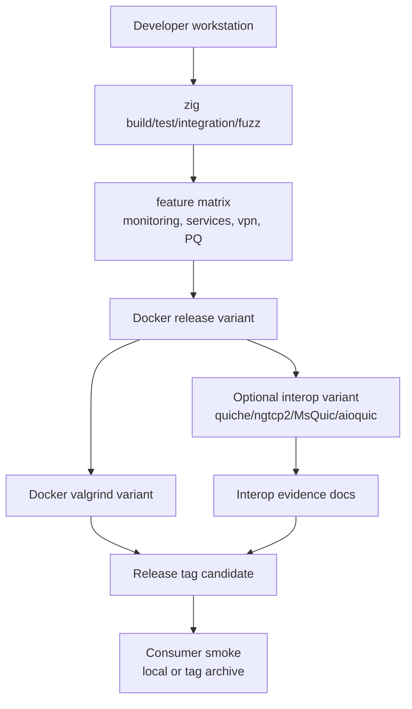

# Release Validation

Release validation combines local Zig builds, feature matrices, Docker
verification, valgrind, optional external interop tools, and consumer smoke.

## Validation Pipeline



## Commands

| Stage | Command |
|-------|---------|
| Default tests | `zig build test --summary all` |
| Integration | `zig build integration-tests --summary all` |
| Fuzz | `zig build fuzz-tests --summary all` |
| Full validation | `./dev/validate.sh` |
| Docker release | `./dev/docker_validate.sh release` |
| Docker valgrind | `./dev/docker_validate.sh valgrind` |
| Docker interop | `./dev/docker_validate.sh interop` |
| Consumer smoke | `./dev/consumer_smoke_test.sh` |

`./dev/docker_validate.sh interop` forwards `ZQUIC_INTEROP_*`,
`*_INTEROP_CMD`, and external client command variables into the container. Use
`ZQUIC_INTEROP_REQUIRE_TRANSPORT_CLOSE=1` when a release gate must fail unless
at least one stateless-reset, Retry, CONNECTION_CLOSE, or draining command runs
against an installed external implementation.

## Docker Output Cleanup

Docker can leave root-owned cache or output directories depending on daemon
configuration. Restore ownership from the repository root:

```bash
sudo chown -R "$(id -u):$(id -g)" .zig-cache zig-cache zig-out 2>/dev/null || true
```

Prefer `/tmp` cache directories for local validation when possible:

```bash
env ZIG_GLOBAL_CACHE_DIR=/tmp/zig-global-cache \
    ZIG_LOCAL_CACHE_DIR=/tmp/zquic-zig-cache \
    /opt/zig-dev/zig build test --summary all
```
