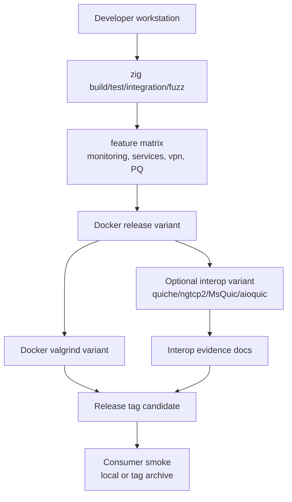

# Release Validation

Release validation combines local Zig builds, feature matrices, Docker
verification, valgrind, optional external interop tools, and consumer smoke.

## Validation Pipeline



## Commands

| Stage | Command |
|-------|---------|
| Default tests | `zig build test --summary all` |
| Integration | `zig build integration-tests --summary all` |
| Fuzz | `zig build fuzz-tests --summary all` |
| Full validation | `./dev/validate.sh` |
| Docker release | `./dev/docker_validate.sh release` |
| Docker valgrind | `./dev/docker_validate.sh valgrind` |
| Docker interop libraries | `./dev/docker_validate.sh interop-libs` |
| Docker interop | `./dev/docker_validate.sh interop` |
| Docker Debian interop tools | `./dev/docker_validate.sh interop-tools` |
| Docker source-built interop tools | `./dev/docker_validate.sh interop-source-tools` |
| Docker Debian interop smoke | `./dev/docker_validate.sh interop-debian` |
| Docker zquic server probe | `./dev/docker_validate.sh interop-zquic-server` |
| Consumer smoke | `./dev/consumer_smoke_test.sh` |

`./dev/docker_validate.sh interop` forwards `ZQUIC_INTEROP_*`,
`*_INTEROP_CMD`, and external client command variables into the container. Use
`ZQUIC_INTEROP_REQUIRE_TRANSPORT_CLOSE=1` when a release gate must fail unless
at least one stateless-reset, Retry, CONNECTION_CLOSE, or draining command runs
against an installed external implementation.

The Docker verification image is pinned to Alpine 3.24.1 and installs packaged
`py3-aioquic`, ngtcp2, nghttp3, and MsQuic runtime/development dependencies.
The image exposes a repo-provided `aioquic-client` command backed by Alpine's
`py3-aioquic` package, and `./dev/docker_validate.sh interop-libs` compiles
and links minimal probes for ngtcp2, ngtcp2-gnutls, nghttp3, and MsQuic. Alpine
does not currently provide runnable `quiche-client`, `h3client`,
`ngtcp2-client`, or `quicinterop` entrypoints in this image. Audit the
container with `docker/interop-tools.sh` before counting an interop run as
external release evidence.

The heavier `zquic-interop` service uses Debian trixie slim and installs
Debian-packaged ngtcp2 client/server tooling plus aioquic. It exposes
`gtlsclient` for ngtcp2 client smoke checks without installing those tools on
the host. It also source-builds pinned quiche and MsQuic command-line tools
inside the image so `quiche-client`, `quicinterop`, and related commands can be
audited by the interop harness. `quicinterop` is an interop matrix/tooling
entrypoint, not a generic target-URL client; set `MSQUIC_CLIENT_CMD` to a
concrete MsQuic client invocation before counting MsQuic client evidence.

`./dev/docker_validate.sh interop-zquic-server` starts the live
`zquic-interop-probe-server` UDP endpoint, runs quiche, ngtcp2/gtlsclient, and
aioquic against it from the Debian image, and requires qlog-style evidence that
zquic received external Initial datagrams, decrypted at least one Initial,
observed a CRYPTO frame, sent protected server Initial CRYPTO from the
connection-owned outgoing raw queue, and reached either the Handshake-key
boundary or an encrypted Initial close. Opt-in gates cover the complete TLS
flight, peer Finished authentication, application packet protection, ACKs, and
the HTTP/3 boundary. With `ZQUIC_INTEROP_REQUIRE_HTTP3_RESPONSE=1`, the gate
also requires the SETTINGS/request/response qlog events and an exact `zquic\n`
body decoded by ngtcp2/gtlsclient. The separate
`ZQUIC_INTEROP_REQUIRE_AIOQUIC_HTTP3_RESPONSE=1` gate proves the same body with
aioquic. `ZQUIC_INTEROP_REQUIRE_QUICHE_HTTP3_RESPONSE=1` independently proves
the status, headers, exact body, and FIN with quiche using the offered ECDSA
P-256 identity. This remains narrow probe evidence: production routing,
broader QPACK, and graceful close remain pending. See
`docs/interop/methodology.md` for the evidence ladder and qlog event taxonomy.

## Docker Output Cleanup

Docker can leave root-owned cache or output directories depending on daemon
configuration. Restore ownership from the repository root:

```bash
sudo chown -R "$(id -u):$(id -g)" .zig-cache zig-cache zig-out 2>/dev/null || true
```

Local validation should use Zig's normal repo-local `.zig-cache` and `zig-out`
outputs.
