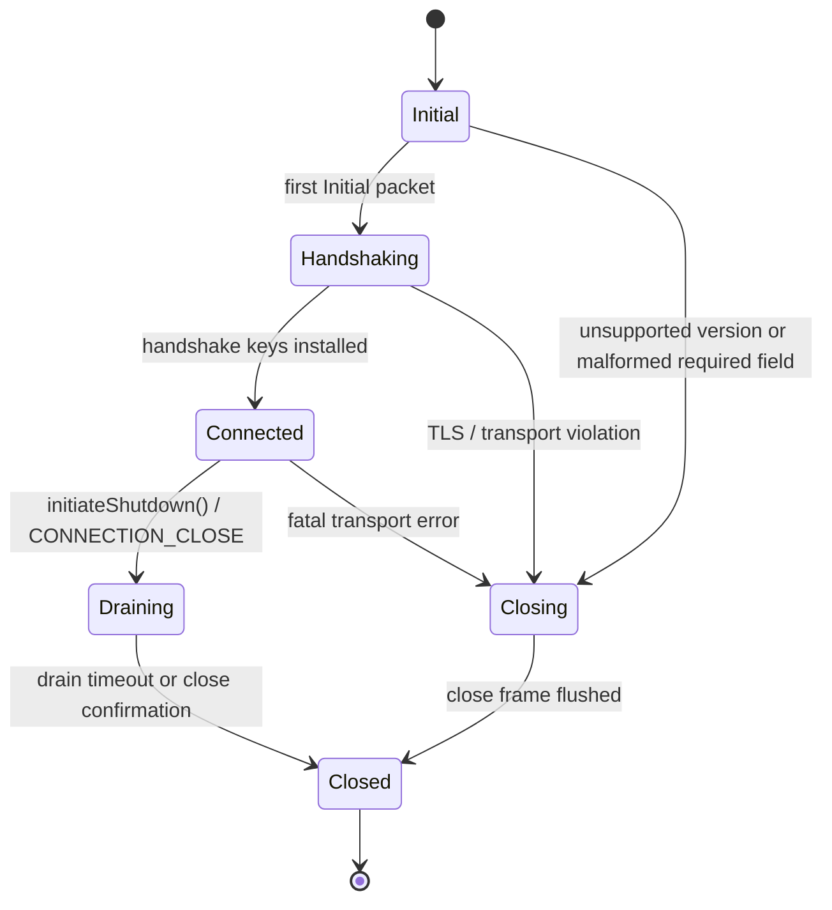
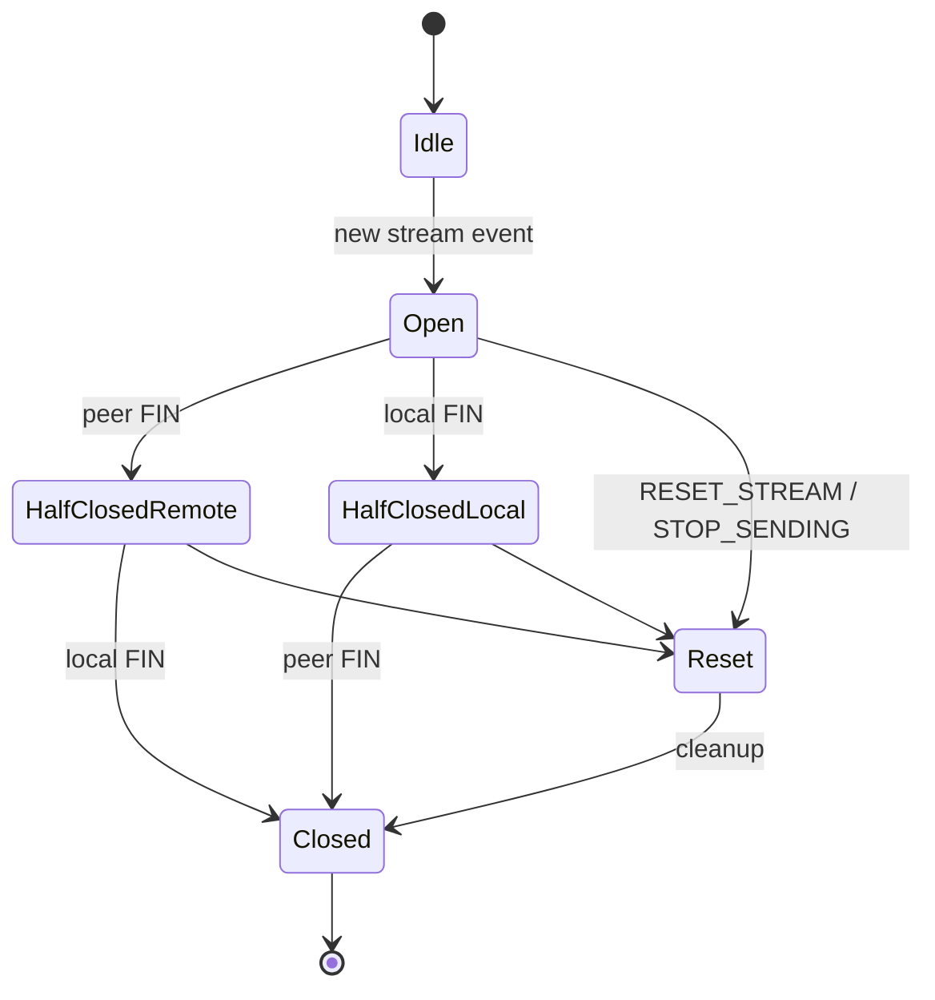
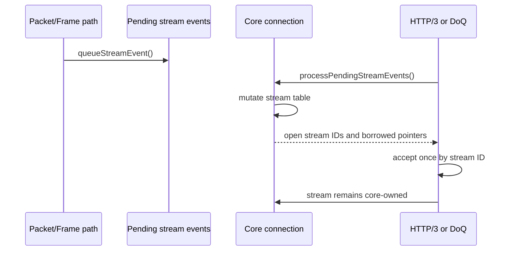
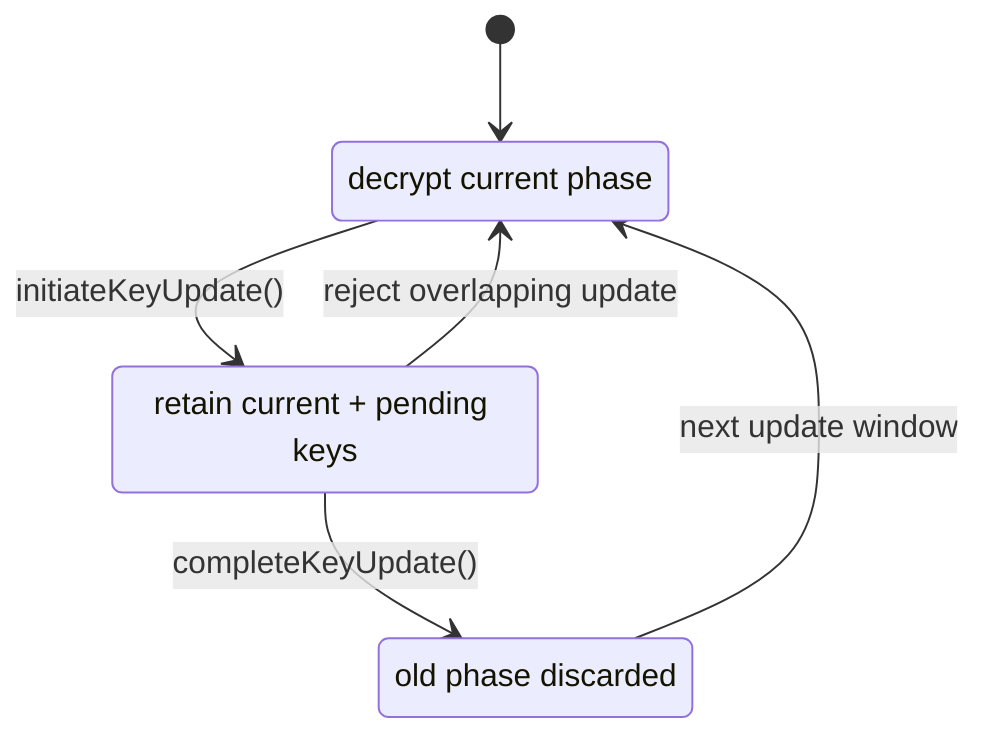
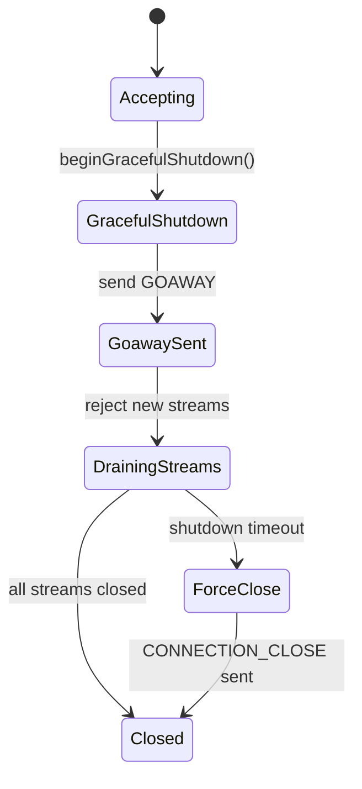
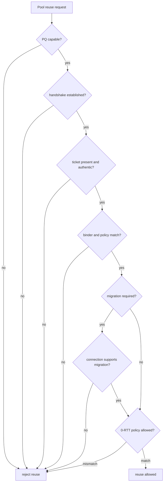

# State Machines

This page documents the state transitions that matter when reading zquic core,
HTTP/3 shutdown, stream lifecycle, and crypto update code. It is a map of the
current implementation posture, not a complete RFC conformance claim.

## Connection Lifecycle

## Stream Lifecycle

## Event Queue Ownership

The protocol layer does not own stream memory. It tracks IDs, request state,
and borrowed stream pointers that must not outlive the connection.

## Key Phase Lifecycle

Key update tests cover overlapping update rejection, old-key discard,
packet-number continuity, rollback rejection, and wrong-key decrypt failures.

## Advanced HTTP/3 Shutdown

Shutdown stops new work first, then attempts to drain active streams. Timeout
paths release connection context and close transport state predictably.

## PQ Preview Reuse Gate

PQ pooling remains preview-grade. The reuse gate exists to fail closed on
issuer, ticket, MAC, binder, migration, or early-data policy mismatch.
