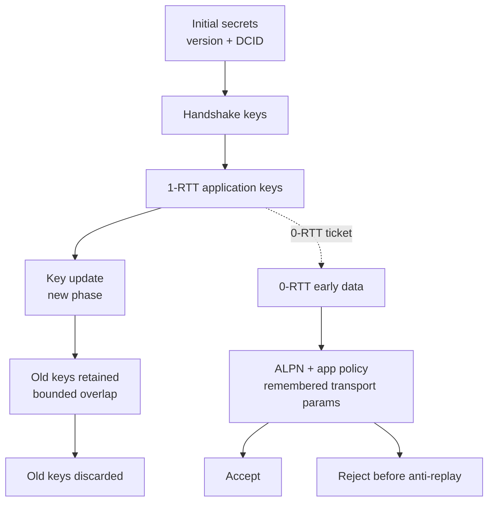
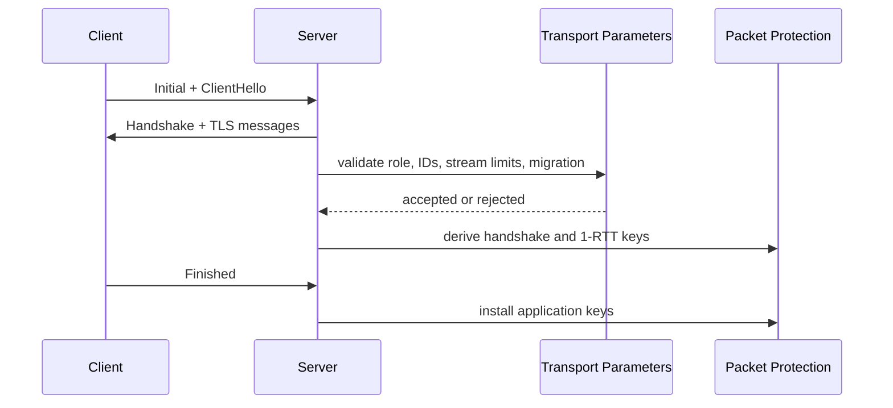

# TLS And Key Lifecycle

ZQUIC uses zcrypto primitives for packet protection and keeps broader TLS 1.3
work clearly separated by maturity. Production certificate-chain and hostname
validation are not claimed by the experimental comprehensive TLS scaffold.

## QUIC Key Lifecycle

## Handshake Validation

## Maturity Boundaries

| Surface | Status | Notes |
|---------|--------|-------|
| QUIC packet protection helpers | Supported default | Covered by key update and negative decrypt tests |
| Transport parameter encode/decode | Supported default | Interop-style fixtures and validation tests |
| 0-RTT ticket policy | Supported helper | Binds ALPN, application policy, and remembered transport parameters |
| Raw Ed25519 public-key verification | Bounded helper | Caller supplies the trusted public key |
| DER/X.509 validation | Not supported | Fails closed in `comprehensive_tls.zig` |
| PQ/hybrid TLS | Experimental | Requires both PQ build flags |

See [RFC 9001 Crypto Audit](../features/rfc9001-crypto-audit.md) and
[Crypto Maturity](../features/crypto-maturity.md).
