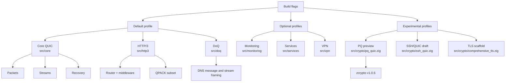
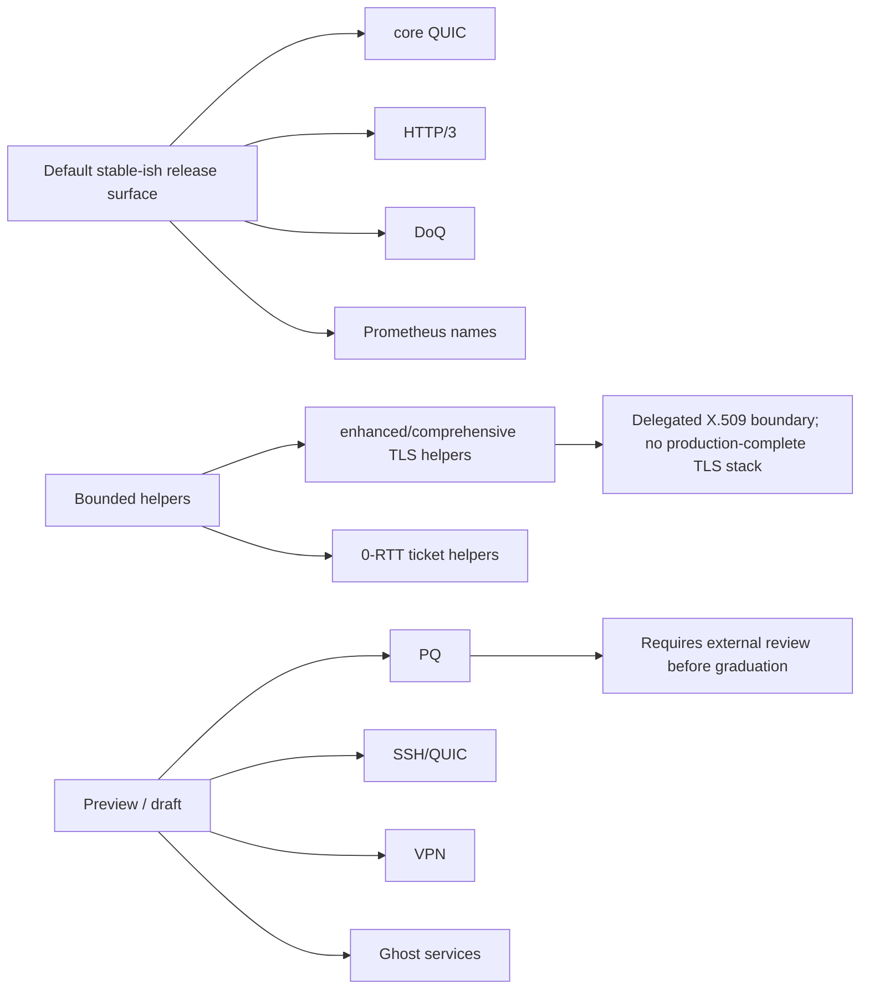
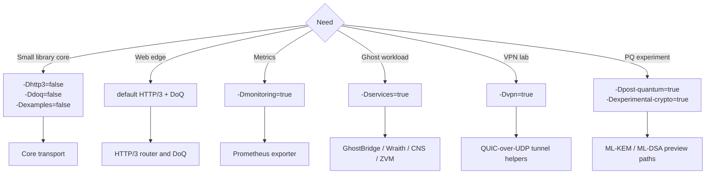

# Feature Overview

ZQUIC ships as a collection of composable subsystems. Every directory under `src/` wires into the build graph through feature flags so you can ship a 1.3 MB QUIC core or a full HTTP/3 + DoQ + VPN control plane.

## Feature Surface Map

## Maturity Overview

## Core Transport
- QUIC v1 handshake, streams, congestion control, and pacing live in `src/core/`.
- The internal async runtime replaces the old zsync dependency and powers the event loop, timers, and zero-copy packet pipeline.
- Ecosystem positioning notes against quiche, ngtcp2, MsQuic, and aioquic live in `docs/features/quic-ecosystem.md`.
- v0.9.15 interop planning and the optional smoke harness are tracked in `docs/features/quic-interop.md`.

## SSH/QUIC Integration
- `src/crypto/ssh_quic.zig` implements [draft-denis-ssh-quic](https://datatracker.ietf.org/doc/draft-denis-ssh-quic/) secret injection.
- Allows SSH key exchange to **bypass TLS handshake** entirely—useful for SSH-over-QUIC tunnels or environments where SSH authentication is already established.
- `SshQuicSecrets` holds pre-derived 32-byte client/server secrets with secure zeroing support.
- `SshQuicContext` wraps `TlsContext` and supports both SSH-injected and standard TLS modes.
- Proper bidirectional encryption: client→server and server→client use separate key material.
- Security: secrets passed by pointer, automatic `secureZero()` on cleanup.
- Status: draft integration. See `docs/features/crypto-maturity.md` for support boundaries.

## Crypto Module Maturity
- Supported default crypto lives in `src/core/crypto.zig` plus stable zcrypto primitives.
- `enhanced_tls.zig` is a QUIC TLS utility surface, while `comprehensive_tls.zig` exposes a bounded experimental engine with zcrypto-backed record parsing, delegated X.509 verification, ALPN validation, and raw Ed25519 CertificateVerify checks; `hybrid_pq_tls.zig` remains experimental scaffolding.
- Current module-level posture is documented in `docs/features/crypto-maturity.md`.
- RFC 9001 packet protection, TLS, key lifecycle, 0-RTT, and Retry gaps are
  tracked in `docs/features/rfc9001-crypto-audit.md`.

## HTTP/3 + Middleware
- `src/http3/` contains the router, middleware pipeline, QPACK codecs, and the advanced server used by GhostBridge/Wraith.
- Middleware is global by default—fallback/404 responses still flow through auth/logging/static handlers.
- Current RFC 9114 coverage notes live in `docs/features/http3-doq-compliance.md`.

## DNS-over-QUIC (DoQ)
- `src/doq/` exposes a DNS resolver/server stack with post-quantum TLS hooks.
- The server now emits Prometheus metrics for query counts, errors, and active connections so operators can monitor real deployments.
- Current RFC 9250 coverage notes live in `docs/features/http3-doq-compliance.md`.

## Services
- `src/services/` contains Ghost-specific and experimental higher-level modules.
- Service maturity is documented in `docs/features/services.md` and exposed through `zquic.services.service_descriptors`.

## Post-Quantum Crypto (Experimental)
- PQ code paths require both `-Dpost-quantum=true` and `-Dexperimental-crypto=true`.
- Current primitives use zcrypto `v1.0.6`: ML-KEM for key encapsulation and ML-DSA-65 for authentication helpers.
- PQ multiplexer integration remains deferred; see `docs/future-features.md` for that release boundary.

## QUIC VPN (Experimental)
- `src/vpn/router.zig` implements an in-progress packet router that pushes QUIC-encrypted traffic over UDP tunnels.
- Think of it as a **conceptual alternative to mesh VPNs (Tailscale, NetBird, etc.)**—useful for research and lab topologies but not a drop-in replacement yet.
- Dedicated docs live in `docs/features/quic-vpn.md` and two runnable demos (`examples/quic_vpn_server.zig` + `examples/quic_vpn_client.zig`).

## Monitoring + Telemetry
- `src/monitoring/` now includes a Prometheus exporter that surfaces HTTP/3, DoQ, and VPN counters/gauges.
- Telemetry ties back into the existing crypto-focused analytics in `monitoring/crypto_telemetry.zig`.

## Integrations
- `docs/integrations/` covers real-world wiring for Prometheus and zcrypto tuning.
- More guides will be added as people contribute recipes for Envoy, HAProxy, or observability stacks.

## Feature Routing

