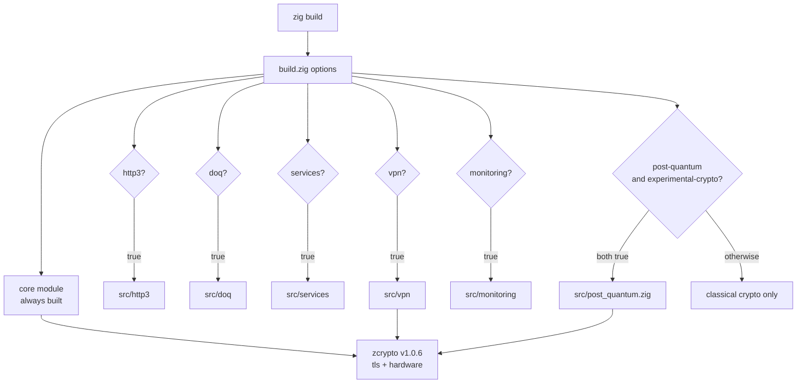
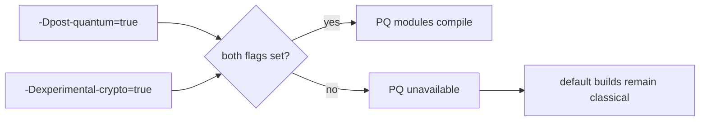

# Build Configuration

ZQUIC ships with a small set of build flags that mirror the switches inside `build.zig`. Keeping this list tight makes migrating to Zig 0.17.0-dev straightforward.

## Feature Flags

| Flag | Default | Description |
|------|---------|-------------|
| `-Dhttp3[=bool]` | `true` | Enable HTTP/3 server, router, middleware, and QPACK modules |
| `-Ddoq[=bool]` | `true` | Build DNS-over-QUIC client/server support |
| `-Dservices[=bool]` | `false` | Include GhostBridge, Wraith, CNS resolver, and service glue |
| `-Dvpn[=bool]` | `false` | Build VPN helpers that depend on the services layer |
| `-Dpost-quantum[=bool]` | `false` | Enable PQ handshakes via `zcrypto` (ML-KEM + ML-DSA-65 auth helpers) |
| `-Dexperimental-crypto[=bool]` | `false` | Required for PQ features; enables experimental zcrypto APIs |
| `-Dmonitoring[=bool]` | `false` | Compile monitoring/telemetry surfaces |
| `-Dexamples[=bool]` | `true` | Produce runnable samples in `zig-out/bin/` |

**Note**: Post-quantum cryptography requires both `-Dpost-quantum=true` AND `-Dexperimental-crypto=true`.

> Tip: flags cascade. Disable `-Dservices` to shrink binaries automatically, regardless of VPN/monitoring settings.

## Build Graph



## PQ Gate



## Common Build Profiles

```bash
# Minimal core stack
zig build -Dhttp3=false -Ddoq=false -Dservices=false -Dvpn=false -Dexamples=false -Doptimize=ReleaseSmall

# Web edge tier (stable crypto only)
zig build -Dhttp3=true -Ddoq=true -Dservices=false -Dvpn=false -Doptimize=ReleaseFast

# Default build (HTTP/3, DoQ, no PQ)
zig build  # enables HTTP/3, DoQ; PQ disabled by default

# With post-quantum crypto (experimental)
zig build -Dpost-quantum=true -Dexperimental-crypto=true

# Full optional feature build
zig build -Dservices=true -Dvpn=true -Dmonitoring=true -Doptimize=ReleaseSafe

# Cross-compile to Windows
zig build -Dhttp3=false -Dservices=false -Dtarget=x86_64-windows -Doptimize=ReleaseSafe
```

## ⚙️ Optimization & Targets

- `-Doptimize=Debug` (default) – fast iteration, assertions enabled
- `-Doptimize=ReleaseSafe` – runtime safety with good performance
- `-Doptimize=ReleaseFast` – peak throughput for benchmarking
- `-Doptimize=ReleaseSmall` – minimal binary size

Combine with `-Dtarget=<arch-os-abi>` for cross builds. Example: `-Dtarget=aarch64-linux-musl` for static ARM64 images.

## 📦 Using ZQUIC as a Dependency

```zig
const std = @import("std");

pub fn build(b: *std.Build) !void {
    const target = b.standardTargetOptions(.{});
    const optimize = b.standardOptimizeOption(.{});

    const zquic_dep = b.dependency("zquic", .{
        .target = target,
        .optimize = optimize,
        .http3 = true,
        .doq = false,
        .services = false,
        .vpn = false,
        .@"post-quantum" = true,
        .@"experimental-crypto" = true,
        .monitoring = false,
    });

    const exe = b.addExecutable(.{
        .name = "my-quic-app",
        .root_module = b.createModule(.{
            .root_source_file = b.path("src/main.zig"),
            .target = target,
            .optimize = optimize,
        }),
    });

    exe.root_module.addImport("zquic", zquic_dep.module("zquic"));
    b.installArtifact(exe);
}
```

The dependency inherits the same Zig toolchain. This release is validated with
`/opt/zig-dev/zig` and package metadata requires
`0.17.0-dev.657+2faf8debf` or newer.

## 🔬 Development Tips

- **Format** – `./dev/fmt.sh`
- **Release validation** – `./dev/validate.sh`
- **Full test suite** – `./dev/test.sh` (unit, integration, and fuzz tests outside CI)
- **Targeted runs** – `zig build integration-tests` or `zig build fuzz-tests` for faster iteration
- **Smoke tests** – `./dev/smoke_test.sh` launches HTTP/3 and DoQ demos
- **Clean builds** – `./dev/clean.sh && zig build -Doptimize=ReleaseFast`

## 📊 Size Expectations

| Config | Approx Size | Notes |
|--------|-------------|-------|
| Core only | ~1.3 MB | Async runtime + core QUIC |
| + HTTP/3 + DoQ | ~3.5 MB | Web edge targets |
| + Services | ~4.6 MB | Adds GhostBridge/Wraith |
| + VPN + Monitoring | ~5.5 MB | Full enterprise stack |

Actual size depends on target triple, optimization mode, and libc choice.

## Next Steps

- Read `docs/getting-started/quick-start.md` to run the demos
- Browse `examples/*.zig` for reference server/client setups
- See `CHANGELOG.md` for release notes
