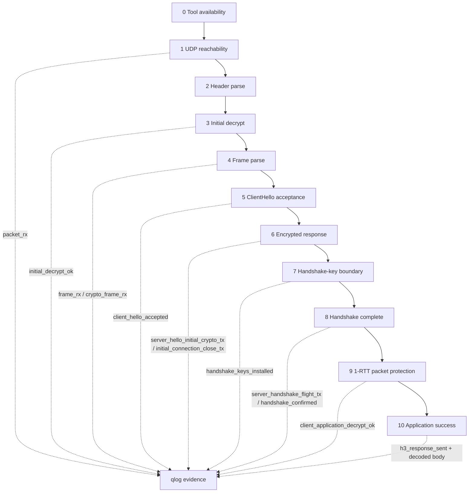
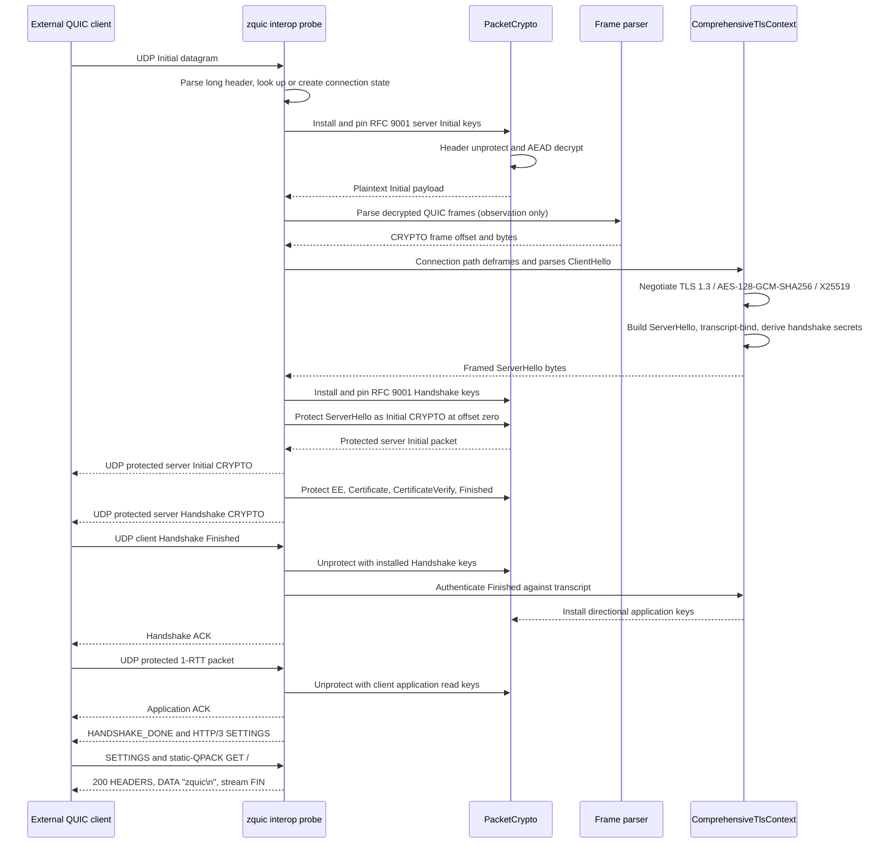
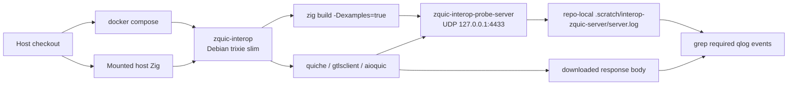

# QUIC Interop Methodology

This document defines how zquic classifies interop evidence. It keeps release
notes, Docker gates, and qlog-style traces aligned so a packet observation is
not mistaken for a completed QUIC or HTTP/3 handshake.

## Evidence Levels

| Level | Name | Required evidence |
|-------|------|-------------------|
| 0 | Tool availability | External command is installed and runnable in the Docker image. |
| 1 | UDP reachability | zquic receives datagrams from an external client. |
| 2 | Header parse | zquic parses packet form, version, packet type, and connection IDs. |
| 3 | Initial decrypt | zquic derives RFC 9001 Initial keys and decrypts an external Initial payload. |
| 4 | Frame parse | zquic parses decrypted QUIC frames and observes at least one CRYPTO frame. |
| 5 | ClientHello acceptance | zquic structurally parses an external ClientHello and negotiates TLS 1.3, `TLS_AES_128_GCM_SHA256`, X25519, and QUIC transport parameters. |
| 6 | Encrypted response | zquic sends encrypted Initial responses to the external peer. |
| 7 | Handshake-key boundary | zquic answers with a real transcript-bound ServerHello and installs RFC 9001 Handshake packet-protection keys derived from the shared X25519 secret. |
| 8 | Peer Finished authenticated | zquic emits the complete server flight and authenticates the external client's transcript-bound Finished. |
| 9 | 1-RTT packet protection | zquic installs application keys only after level 8 and decrypts an external short-header packet. |
| 10 | Application success | HTTP/3 or DoQ request/response succeeds over the external connection. |

The dedicated `interop-zquic-server` Docker target gates levels 1 through 6 by
default. Levels 5 and 7 through 9 have opt-in gates because they currently hold
only for the narrow supported TLS parameter set and probe path.

Level 10 is reached narrowly and independently by quiche, ngtcp2/gtlsclient,
and aioquic. All three accept a complete probe flight, exchange HTTP/3
SETTINGS, send `GET /`, and decode the probe's 200 response, six-byte body, and
request-stream FIN.
gtlsclient later reports an idle close because the one-shot probe does not close
the connection. The ephemeral self-signed identity is probe-only and is not
production trust.

## Stable Probe Events

The live probe emits line-delimited qlog-style JSON. These event names are part
of the interop test contract:

| Event | Meaning |
|-------|---------|
| `packet_rx` | A QUIC packet header parsed successfully. |
| `packet_parse_error` | Header parsing failed; unsupported long-header versions may still trigger Version Negotiation. |
| `version_negotiation_tx` | zquic sent a Version Negotiation packet. |
| `initial_decrypt_ok` | RFC 9001 Initial packet protection was removed successfully. |
| `initial_decrypt_failed` | Initial deprotection failed. |
| `frame_rx` | A decrypted QUIC frame parsed successfully. |
| `padding_frames_rx` | A run of decrypted PADDING frames was aggregated for readable logs. |
| `frame_parse_error` | Decrypted payload parsing failed before all frames were consumed. |
| `crypto_frame_rx` | A decrypted CRYPTO frame was observed, including offset and byte length. |
| `client_hello_accepted` | A completely framed ClientHello was structurally parsed and semantically negotiated: TLS 1.3 via `supported_versions`, `TLS_AES_128_GCM_SHA256`, X25519 in `supported_groups` with a corresponding 32-byte `key_share`, `h3` in ALPN, and decodable QUIC transport parameters. The event records how many TLS messages were consumed and the resulting TLS state. |
| `client_hello_rejected` | The connection path refused the message. A non-secret stage identifies structure/profile, ALPN, or transport-parameter rejection; no transcript, peer key share, or negotiated parameter was committed. |
| `server_hello_initial_crypto_tx` | zquic sent a protected server Initial packet from the `SuperConnection` outgoing raw queue carrying the real ServerHello as Initial-level CRYPTO at offset zero. `crypto_len` is the framed ServerHello length. |
| `handshake_keys_installed` | RFC 9001 Handshake packet-protection keys were derived from the X25519 shared secret and `H(ClientHello ‖ ServerHello)` and pinned at the Handshake level. Records level, cipher suite, key exchange, and framed ServerHello length only — never key, IV, header-protection, secret, or shared-secret bytes. |
| `client_handshake_decrypt_ok` | A client Handshake packet was unprotected with those installed keys. This is the strongest available cross-implementation proof that both sides derived the same handshake traffic secrets. |
| `client_handshake_decrypt_failed` | A client Handshake packet arrived but could not be unprotected. |
| `server_handshake_flight_tx` | zquic sent EncryptedExtensions, Certificate, CertificateVerify, and Finished as protected Handshake CRYPTO. |
| `handshake_confirmed` | The client Finished authenticated against the transcript and directional application keys were installed. |
| `client_application_buffered` | A reordered short-header datagram was retained until peer Finished authentication; the fixed eight-packet limit prevents unbounded pre-confirmation buffering. |
| `client_application_before_handshake_confirmed` | A short-header packet arrived before peer Finished authentication and was deferred rather than accepted as application data. |
| `client_application_decrypt_ok` | An external 1-RTT packet authenticated and decrypted with the installed client application read keys. |
| `client_application_decrypt_failed` | A post-handshake 1-RTT packet failed packet protection or plaintext frame processing. |
| `ack_sent` | zquic sent an ACK with its encryption level, packet number, largest acknowledged packet, and exact range count. |
| `ack_received` | zquic strictly processed an ACK in the packet-number space that carried it. |
| `pto_probe_scheduled` | The RFC 9002 loss timer expired and selected one or more active packet-number spaces for probing. |
| `crypto_retransmission` | A PTO probe retransmitted retained CRYPTO bytes at their original encryption level and stream offset. |
| `handshake_timeout` | An incomplete handshake reached its fixed deadline, released retained recovery data, and entered draining. |
| `h3_server_settings_sent` | The probe sent HANDSHAKE_DONE and its zero-capacity HTTP/3 SETTINGS control stream after peer Finished authentication. |
| `h3_peer_settings_received` | A bounded client control stream supplied a valid leading SETTINGS frame. |
| `h3_qpack_stream_seen` | A client QPACK encoder or decoder stream was recognized; dynamic capacity remains zero. |
| `h3_request_accepted` | Static-only QPACK proved `GET /` on a client request stream. |
| `h3_response_sent` | The probe sent its fixed 200 HEADERS, DATA body, and request-stream FIN. The event alone is transmission evidence; the Docker artifact check proves external decoding. |
| `connection_lookup_miss` | A short-header packet did not match both a retained connection ID and remote address; booleans distinguish which lookup component missed without logging IDs. |
| `connection_state_reused` | A later datagram matched an existing `(destination connection ID, remote address)` entry, so the same TLS and packet-protection state continued instead of being rebuilt. |
| `connection_evicted` | A connection was dropped after 30 seconds of inactivity and its key material released. |
| `connection_table_full` | The probe's fixed connection cap was reached; the datagram was traced but not given state. |
| `initial_connection_close_tx` | zquic sent an encrypted Initial CONNECTION_CLOSE response. Only sent when Handshake keys were **not** installed — closing a connection that reached the Handshake-key boundary would destroy the state this phase exists to prove. |

`handshake_keys_installed` alone remains only a boundary event. A completed probe
TLS path additionally requires `server_handshake_flight_tx` and
`handshake_confirmed`; 1-RTT evidence additionally requires
`client_application_decrypt_ok`.

## Live Probe Flow

Frame tracing is observational only; the handshake itself is driven by the
connection path, and the probe emits no synthetic or compatibility TLS bytes
under real Handshake keys. Initial, Handshake, and application keys are pinned,
so nothing downstream can silently replace them. The HTTP/3 path is a bounded
interop probe, not the production router or general HTTP/3 server API.

## Docker Architecture

The smoke script removes its repo-local scratch log on exit. It must not use
system temp directories or Zig cache overrides.

## Current Gates

`./dev/docker_validate.sh interop-zquic-server` requires:

- `packet_rx` or `packet_parse_error`;
- `initial_decrypt_ok`;
- `initial_connection_close_tx` or `handshake_keys_installed`, because those are
  the two terminal outcomes: a connection that could not be negotiated is closed,
  and a connection that reached the Handshake-key boundary is deliberately left
  open; and
- `crypto_frame_rx` unless `ZQUIC_INTEROP_REQUIRE_CRYPTO=0` is set for manual
  debugging; and
- `server_hello_initial_crypto_tx` or `initial_connection_close_tx` unless
  `ZQUIC_INTEROP_REQUIRE_SERVER_CRYPTO_TX=0` is set for manual debugging.

Opt-in gates assert the stronger outcomes. They are off by default because the
complete path is deliberately limited to the probe's supported TLS and HTTP/3
parameter set:

- `ZQUIC_INTEROP_REQUIRE_CLIENT_HELLO_ACCEPTED=1` requires `client_hello_accepted`;
- `ZQUIC_INTEROP_REQUIRE_HANDSHAKE_KEYS=1` requires `handshake_keys_installed`;
- `ZQUIC_INTEROP_REQUIRE_CONNECTION_STATE_REUSED=1` requires
  `connection_state_reused`.
- `ZQUIC_INTEROP_REQUIRE_SERVER_HANDSHAKE_FLIGHT=1` requires
  `server_handshake_flight_tx`;
- `ZQUIC_INTEROP_REQUIRE_HANDSHAKE_CONFIRMED=1` requires `handshake_confirmed`;
- `ZQUIC_INTEROP_REQUIRE_APPLICATION_DECRYPT=1` requires
  `client_application_decrypt_ok`;
- `ZQUIC_INTEROP_REQUIRE_ACK_SENT=1` requires `ack_sent`;
- `ZQUIC_INTEROP_REQUIRE_ACK_RECEIVED=1` requires `ack_received`;
- `ZQUIC_INTEROP_REQUIRE_PTO_PROBE=1` requires `pto_probe_scheduled`;
- `ZQUIC_INTEROP_REQUIRE_CRYPTO_RETRANSMISSION=1` requires
  `crypto_retransmission`; and
- `ZQUIC_INTEROP_REQUIRE_HANDSHAKE_TIMEOUT=1` requires `handshake_timeout`.
- `ZQUIC_INTEROP_REQUIRE_HTTP3_RESPONSE=1` requires all four HTTP/3 qlog
  boundary events and an exact externally decoded `zquic\n` body.
- `ZQUIC_INTEROP_REQUIRE_AIOQUIC_HTTP3_RESPONSE=1` independently requires a
  successful aioquic status and its exact decoded `zquic\n` body.
- `ZQUIC_INTEROP_REQUIRE_QUICHE_HTTP3_RESPONSE=1` independently requires
  quiche's successful status, decoded headers, exact `zquic\n` body, and FIN.

The probe now keeps per-connection TLS and packet-protection state between
datagrams, so an accepted ClientHello is answered with a real ServerHello and the
Handshake keys derived from it stay installed. Native coverage verifies the
end-to-end exchange against an independent `std.crypto` client, that Initial and
Handshake packet-number spaces stay independent, that interleaved connection IDs
derive different keys, and that a rejected ClientHello installs no keys.

This proves one minimal external HTTP/3 exchange, not general HTTP/3 support.
Dynamic QPACK, request bodies, concurrent requests, graceful connection close,
GOAWAY, application key update, and production routing remain outside the
probe. Its Ed25519 and ECDSA P-256 identities remain ephemeral and self-signed,
so this is not production certificate validation.
