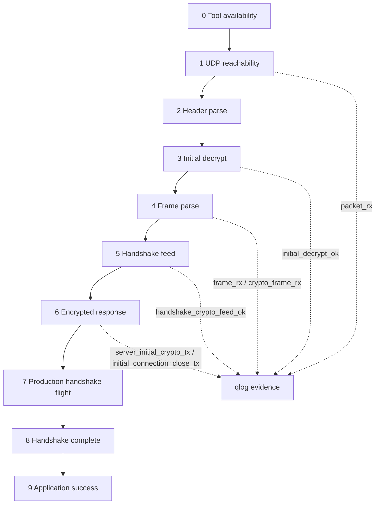
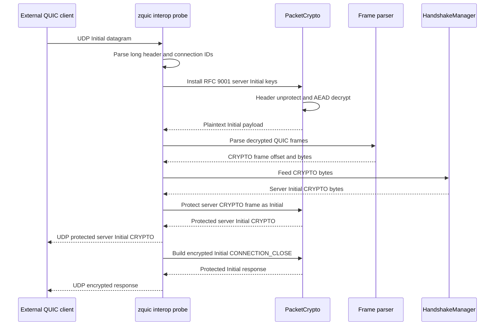
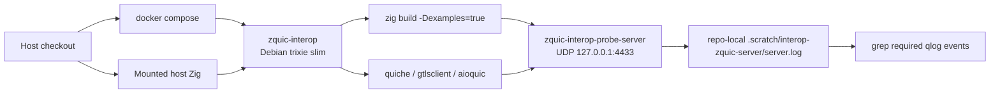

# QUIC Interop Methodology

This document defines how zquic classifies interop evidence. It keeps release
notes, Docker gates, and qlog-style traces aligned so a packet observation is
not mistaken for a completed QUIC or HTTP/3 handshake.

## Evidence Levels

| Level | Name | Required evidence |
|-------|------|-------------------|
| 0 | Tool availability | External command is installed and runnable in the Docker image. |
| 1 | UDP reachability | zquic receives datagrams from an external client. |
| 2 | Header parse | zquic parses packet form, version, packet type, and connection IDs. |
| 3 | Initial decrypt | zquic derives RFC 9001 Initial keys and decrypts an external Initial payload. |
| 4 | Frame parse | zquic parses decrypted QUIC frames and observes at least one CRYPTO frame. |
| 5 | Handshake feed | zquic feeds decrypted CRYPTO bytes into the handshake manager. |
| 6 | Encrypted response | zquic sends encrypted Initial responses to the external peer. |
| 7 | Handshake flight | zquic emits production server Initial and Handshake CRYPTO packets. |
| 8 | Handshake complete | zquic and the external stack confirm the QUIC handshake. |
| 9 | Application success | HTTP/3 or DoQ request/response succeeds over the external connection. |

The dedicated `interop-zquic-server` Docker target currently gates levels 1
through 6, including protected server Initial CRYPTO transmission from the
connection-owned outgoing raw queue. Native tests cover protected
Handshake-space CRYPTO scheduling, but live external Handshake-space flight,
full handshake confirmation, and application success remain future gates.

## Stable Probe Events

The live probe emits line-delimited qlog-style JSON. These event names are part
of the interop test contract:

| Event | Meaning |
|-------|---------|
| `packet_rx` | A QUIC packet header parsed successfully. |
| `packet_parse_error` | Header parsing failed; unsupported long-header versions may still trigger Version Negotiation. |
| `version_negotiation_tx` | zquic sent a Version Negotiation packet. |
| `initial_decrypt_ok` | RFC 9001 Initial packet protection was removed successfully. |
| `initial_decrypt_failed` | Initial deprotection failed. |
| `frame_rx` | A decrypted QUIC frame parsed successfully. |
| `padding_frames_rx` | A run of decrypted PADDING frames was aggregated for readable logs. |
| `frame_parse_error` | Decrypted payload parsing failed before all frames were consumed. |
| `crypto_frame_rx` | A decrypted CRYPTO frame was observed, including offset and byte length. |
| `handshake_crypto_feed_ok` | CRYPTO bytes were accepted by the server-side handshake manager. |
| `handshake_crypto_feed_failed` | Parsed CRYPTO bytes were rejected by the current handshake manager. |
| `server_initial_crypto_ready` | The handshake manager produced server-side CRYPTO bytes. |
| `server_initial_crypto_tx` | zquic sent those bytes as a protected server Initial CRYPTO packet from the `SuperConnection` outgoing raw queue. |
| `initial_connection_close_tx` | zquic sent an encrypted Initial CONNECTION_CLOSE response. |

The current Docker evidence also shows an external follow-up Initial ACK after
`server_initial_crypto_tx`. That is useful signal that the peer processed the
protected server Initial packet, but it is not counted as Handshake-space flight
or handshake completion.

## Live Probe Flow

The probe keeps handshake feed observational. It does not mutate the Initial
packet keys used for the encrypted responses, and it does not claim to be the
production QUIC accept loop, production TLS handshake flight, or HTTP/3 server
path.

## Docker Architecture

The smoke script removes its repo-local scratch log on exit. It must not use
system temp directories or Zig cache overrides.

## Current Gates

`./dev/docker_validate.sh interop-zquic-server` requires:

- `packet_rx` or `packet_parse_error`;
- `initial_decrypt_ok`;
- `initial_connection_close_tx`; and
- `crypto_frame_rx` unless `ZQUIC_INTEROP_REQUIRE_CRYPTO=0` is set for manual
  debugging; and
- `server_initial_crypto_tx` unless `ZQUIC_INTEROP_REQUIRE_SERVER_CRYPTO_TX=0`
  is set for manual debugging.

The Docker probe now uses the connection layer's queue-facing helper for
protected server Initial CRYPTO scheduling while retaining qlog evidence in the
probe. The connection layer also has native coverage for scheduling pending
CRYPTO bytes as protected Handshake packets. The next stricter gate should make
that Handshake-space flight live against an external stack. Only after that
should the release gate advance to external handshake confirmation and HTTP/3
request/response success.
