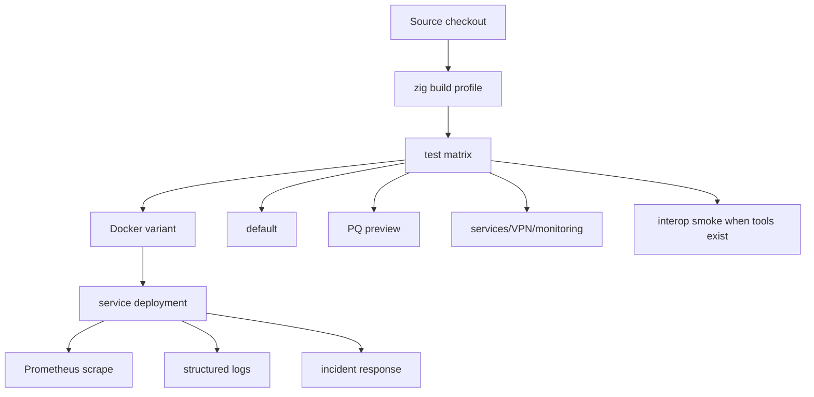
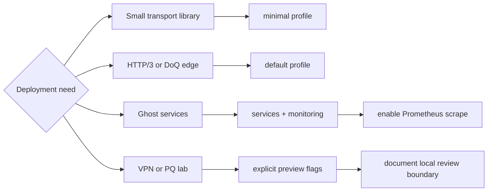
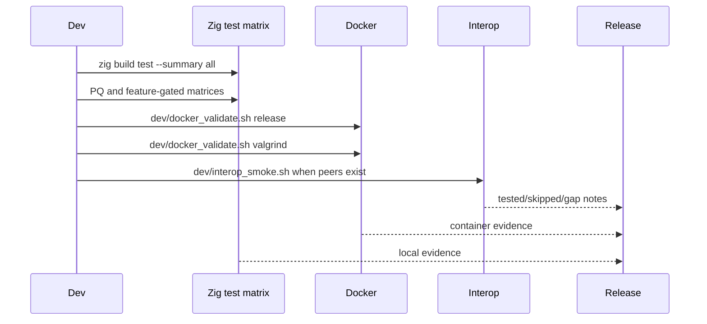
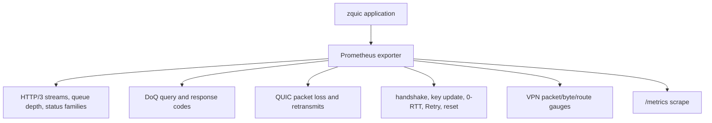
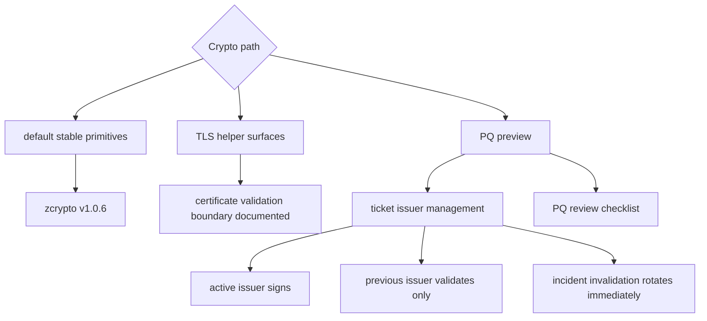
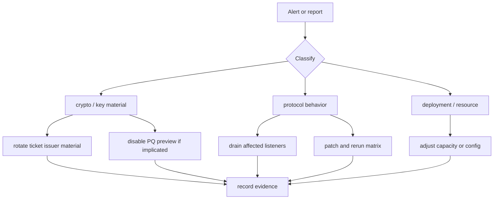

# Deployment Operations

This page collects operational decisions for running zquic-based services. It
focuses on build profiles, validation, observability, crypto posture, and
incident response.

## Deployment Shape

## Build Profile Selection

| Profile | Use when | Required validation |
|---------|----------|---------------------|
| Minimal | embedding core QUIC only | default tests and consumer smoke |
| Default | HTTP/3 + DoQ service path | default tests, integration tests, Docker release variant |
| Monitoring | exporting `zquic_*` metrics | Prometheus docs and metrics test |
| Services | GhostBridge/Wraith/CNS/ZVM surfaces | services build matrix and service maturity docs |
| VPN | lab tunnel experiments | VPN smoke and explicit non-production posture |
| PQ Preview | experimental ML-KEM/ML-DSA path | PQ matrix, PQ review checklist, issuer-management plan |

## Validation Pipeline

## Observability

Metric names are documented in [Prometheus Integration](../integrations/prometheus.md).
Keep dashboards on `zquic_*` names and avoid parsing logs as a substitute for
metrics.

## Crypto Operations

Production deployments must not treat the experimental TLS helper surfaces as a
complete X.509 verifier. PQ deployments need an explicit issuer rotation and
invalidation plan before carrying real traffic.

## Incident Response

Document the exact build flags, zcrypto version, zquic commit, failing evidence,
and validation commands used to clear the incident.
