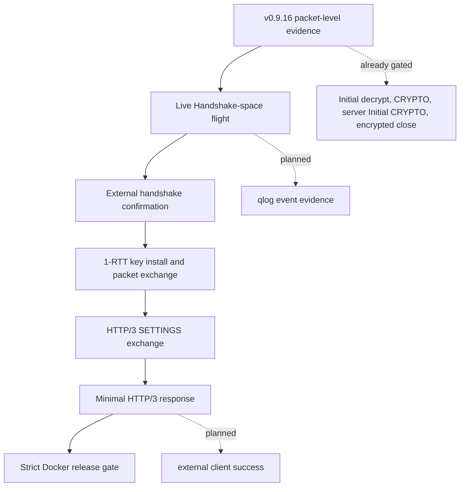

# v0.9.17 Release Plan

`v0.9.17` is planned as the next external interop release after the packet-level
progress in `v0.9.16`. The goal is to move from live Initial-space evidence to
the first external Handshake-space and HTTP/3 success without blurring fixture
coverage, native integration coverage, and external implementation evidence.

## Target Outcome

The primary target is one maintained external QUIC stack completing a minimal
HTTP/3 request/response against zquic inside the Docker interop environment.
Acceptable first-success candidates are quiche, ngtcp2/nghttp3, or aioquic.

## Evidence Ladder

## Milestones

| Milestone | Release evidence |
|-----------|------------------|
| Live Handshake-space flight | zquic sends protected Handshake CRYPTO to an external client, with qlog evidence for packet number space and CRYPTO length. |
| TLS state advancement | live CRYPTO reassembly advances TLS state and installs Handshake then 1-RTT keys at the correct boundaries. |
| ACK and timer loop | Initial and Handshake ACKs, PTO probes, and CRYPTO retransmission are coherent enough for an external client to continue. |
| HTTP/3 bootstrap | ALPN `h3`, 1-RTT keys, HTTP/3 control streams, and SETTINGS exchange work in the live path. |
| Minimal response | at least one external client receives a successful response from a zquic Docker endpoint. |

## Non-Goals

- Do not claim broad QUIC or HTTP/3 interoperability from one external success.
- Do not make skipped external commands count as passing evidence.
- Do not promote experimental PQ, VPN, or service surfaces based on this work.
- Do not replace the existing packet-level gate until the stricter handshake and
  HTTP/3 gates are reliable.

## Planned Validation

The release remains expected to pass the existing local and Docker validation:

- `zig build test --summary all`
- `zig build integration-tests --summary all`
- `zig build fuzz-tests --summary all`
- `./dev/validate.sh`
- `./dev/consumer_smoke_test.sh`
- `./dev/docker_validate.sh release`
- `./dev/docker_validate.sh interop-zquic-server`

New gates should be added only when they can distinguish packet-level progress,
Handshake-space progress, full handshake confirmation, and HTTP/3 response
success.

## Tracking

The detailed engineering checklist lives in `tasks/todo.md` under
`zquic v0.9.17 Task List`. Public docs should summarize the release direction
and evidence policy; implementation details and checkboxes stay in `tasks/`.

Repository hosting is expected to move to `git.cktechx.com`, a self-hosted
GitLab instance maintained with image-based server backups and Wasabi S3
repository backups. The move is intended to provide more control over the CI
environment, runner configuration, and release infrastructure, while GitHub will
likely remain as a backup mirror.
