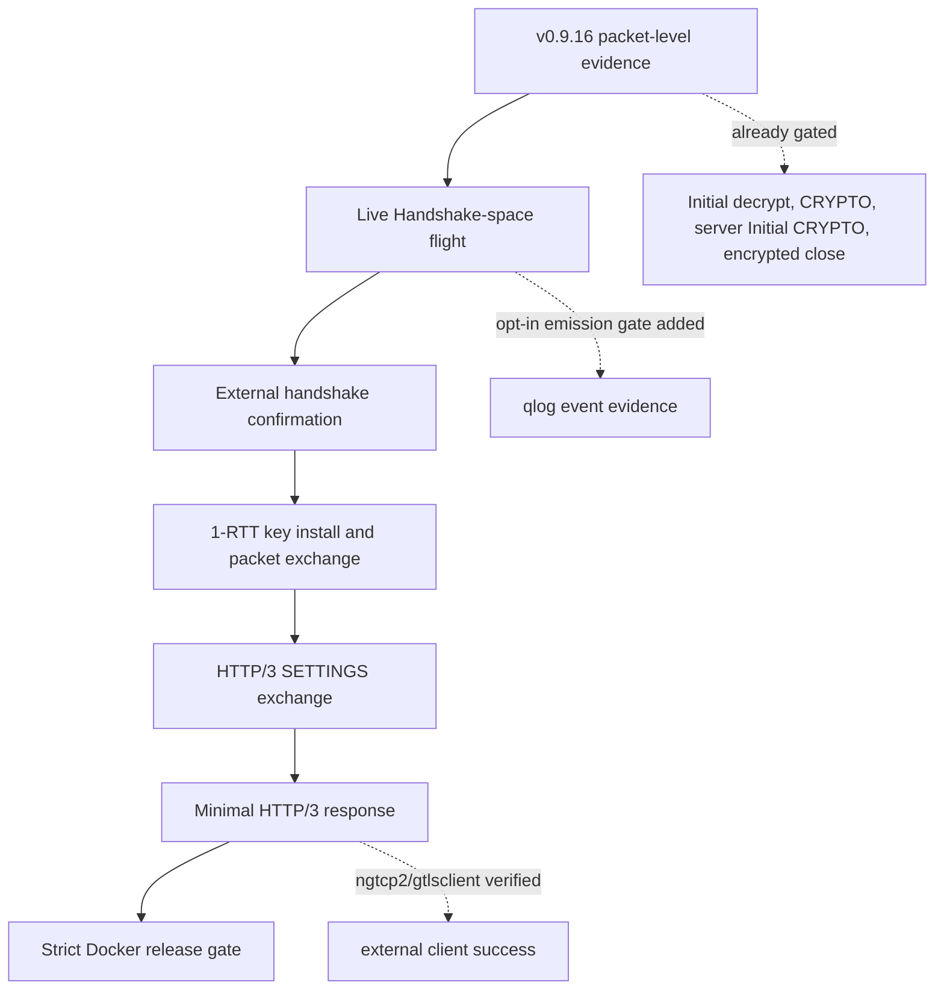

# v0.9.17 Release Plan

`v0.9.17` is the external interop release candidate after the packet-level
progress in `v0.9.16`. It moves from live Initial-space evidence to external
Handshake-space and fixed HTTP/3 success without blurring fixture coverage,
native integration coverage, and external implementation evidence.

## Target Outcome

The achieved target is three maintained external QUIC stacks completing the
same minimal HTTP/3 request/response against zquic inside the Docker interop
environment: quiche, ngtcp2/nghttp3, and aioquic.

## Evidence Ladder

## Milestones

| Milestone | Release evidence |
|-----------|------------------|
| Live Handshake-space flight | The probe sends a complete transcript-bound TLS 1.3 server flight under RFC 9001 Handshake keys. |
| TLS state advancement | Live CRYPTO reassembly authenticates peer Finished before installing directional 1-RTT keys; ngtcp2/gtlsclient reaches this boundary. |
| ACK and timer loop | Initial and Handshake ACKs, PTO probes, and CRYPTO retransmission are coherent enough for an external client to continue. |
| HTTP/3 bootstrap | ALPN `h3`, 1-RTT keys, HTTP/3 control streams, and SETTINGS exchange work in the live path. |
| Minimal response | ngtcp2/gtlsclient decodes the probe's 200 response, six-byte body, and request-stream FIN in Docker. |
| Matrix expansion | aioquic and quiche independently decode the same fixed response; quiche selects the offered ECDSA P-256 identity and tolerates an unknown HTTP/3 GREASE frame before request HEADERS. |

## Non-Goals

- Do not claim broad QUIC or HTTP/3 interoperability from one external success.
- Do not make skipped external commands count as passing evidence.
- Do not promote experimental PQ, VPN, or service surfaces based on this work.
- Do not replace the existing packet-level gate until the stricter handshake and
  HTTP/3 gates are reliable.

## Planned Validation

The release remains expected to pass the existing local and Docker validation:

- `zig build test --summary all`
- `zig build integration-tests --summary all`
- `zig build fuzz-tests --summary all`
- `./dev/validate.sh`
- `./dev/consumer_smoke_test.sh`
- `./dev/docker_validate.sh release`
- `./dev/docker_validate.sh interop-zquic-server`

New gates should be added only when they can distinguish packet-level progress,
Handshake-space progress, full handshake confirmation, and HTTP/3 response
success.

Opt-in gates cover progressively stronger handshake outcomes:
`ZQUIC_INTEROP_REQUIRE_CLIENT_HELLO_ACCEPTED=1` for semantic ClientHello
negotiation, `ZQUIC_INTEROP_REQUIRE_HANDSHAKE_KEYS=1` for RFC 9001 Handshake key
installation, and `ZQUIC_INTEROP_REQUIRE_CONNECTION_STATE_REUSED=1` for
per-connection state retention across datagrams. The stronger
`ZQUIC_INTEROP_REQUIRE_SERVER_HANDSHAKE_FLIGHT=1`,
`ZQUIC_INTEROP_REQUIRE_HANDSHAKE_CONFIRMED=1`, and
`ZQUIC_INTEROP_REQUIRE_APPLICATION_DECRYPT=1` gates cover the complete flight,
authenticated client Finished, and external 1-RTT decryption. ACK, recovery,
and timeout instrumentation has separate opt-in gates:
`ZQUIC_INTEROP_REQUIRE_ACK_SENT=1`,
`ZQUIC_INTEROP_REQUIRE_ACK_RECEIVED=1`,
`ZQUIC_INTEROP_REQUIRE_PTO_PROBE=1`,
`ZQUIC_INTEROP_REQUIRE_CRYPTO_RETRANSMISSION=1`, and
`ZQUIC_INTEROP_REQUIRE_HANDSHAKE_TIMEOUT=1`. The separate
`ZQUIC_INTEROP_REQUIRE_HTTP3_RESPONSE=1` gate requires the four HTTP/3 boundary
events and the exact body downloaded by ngtcp2/gtlsclient. The independent
`ZQUIC_INTEROP_REQUIRE_AIOQUIC_HTTP3_RESPONSE=1` gate requires aioquic's
successful status and exact decoded body. The parallel
`ZQUIC_INTEROP_REQUIRE_QUICHE_HTTP3_RESPONSE=1` gate requires quiche's status,
headers, exact decoded body, and request-stream FIN.

## Tracking

The detailed engineering checklist lives in `tasks/todo.md` under
`zquic v0.9.17 Task List`. Public docs should summarize the release direction
and evidence policy; implementation details and checkboxes stay in `tasks/`.

Repository hosting is expected to move to `git.cktechx.com`, a self-hosted
GitLab instance maintained with image-based server backups and Wasabi S3
repository backups. The move is intended to provide more control over the CI
environment, runner configuration, and release infrastructure, while GitHub will
likely remain as a backup mirror.
